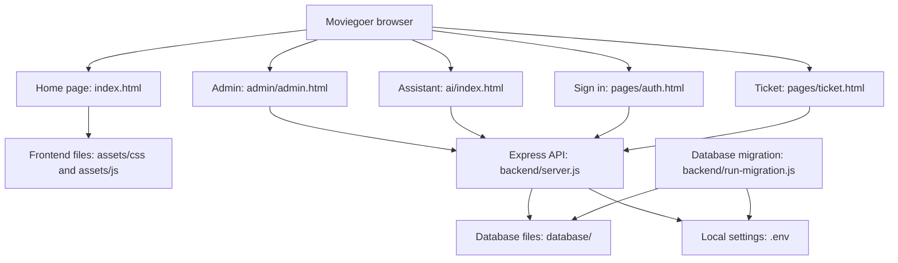

# STARFLY architecture

Open this file in VS Code and choose **Markdown: Open Preview** to view the Mermaid diagram with Markdown Preview Mermaid Support.

```mermaid
flowchart TD
    Browser[Moviegoer browser]
    Home[Home page: index.html]
    Admin[Admin: admin/admin.html]
    AI[Assistant: ai/index.html]
    Auth[Sign in: pages/auth.html]
    Ticket[Ticket: pages/ticket.html]
    Frontend[Frontend files: assets/css and assets/js]
    Backend[Express API: backend/server.js]
    Migration[Database migration: backend/run-migration.js]
    SQL[Database files: database/]
    Env[Local settings: .env]

    Browser --> Home
    Browser --> Admin
    Browser --> AI
    Browser --> Auth
    Browser --> Ticket
    Home --> Frontend
    Admin --> Backend
    AI --> Backend
    Auth --> Backend
    Ticket --> Backend
    Backend --> SQL
    Backend --> Env
    Migration --> SQL
    Migration --> Env
```
